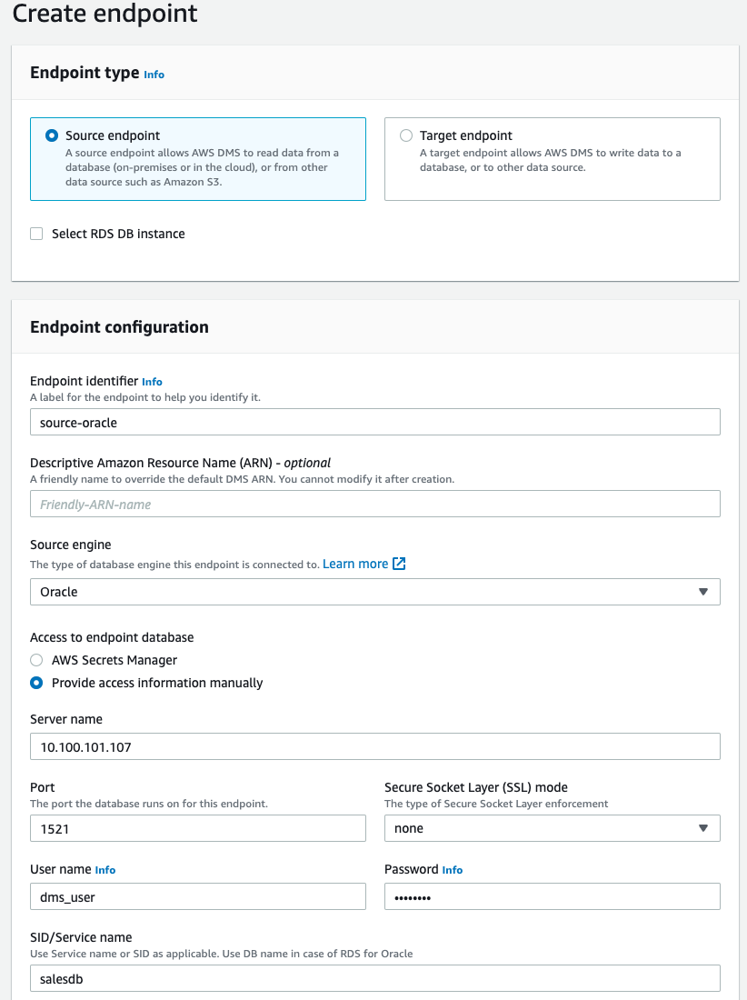
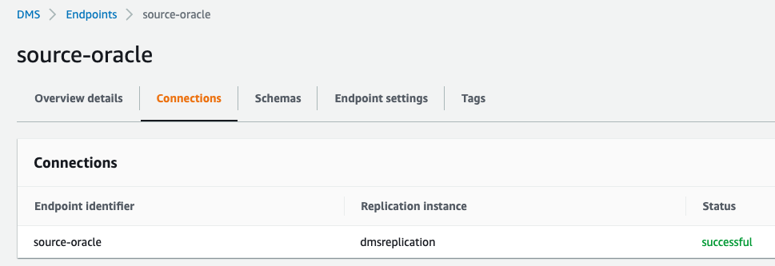
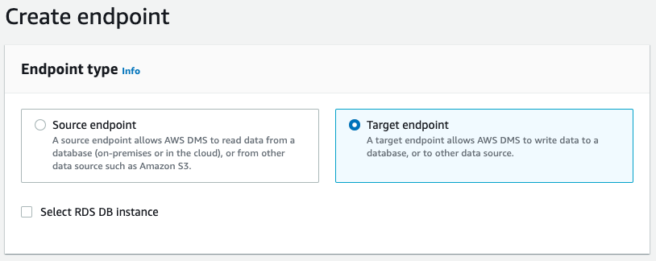
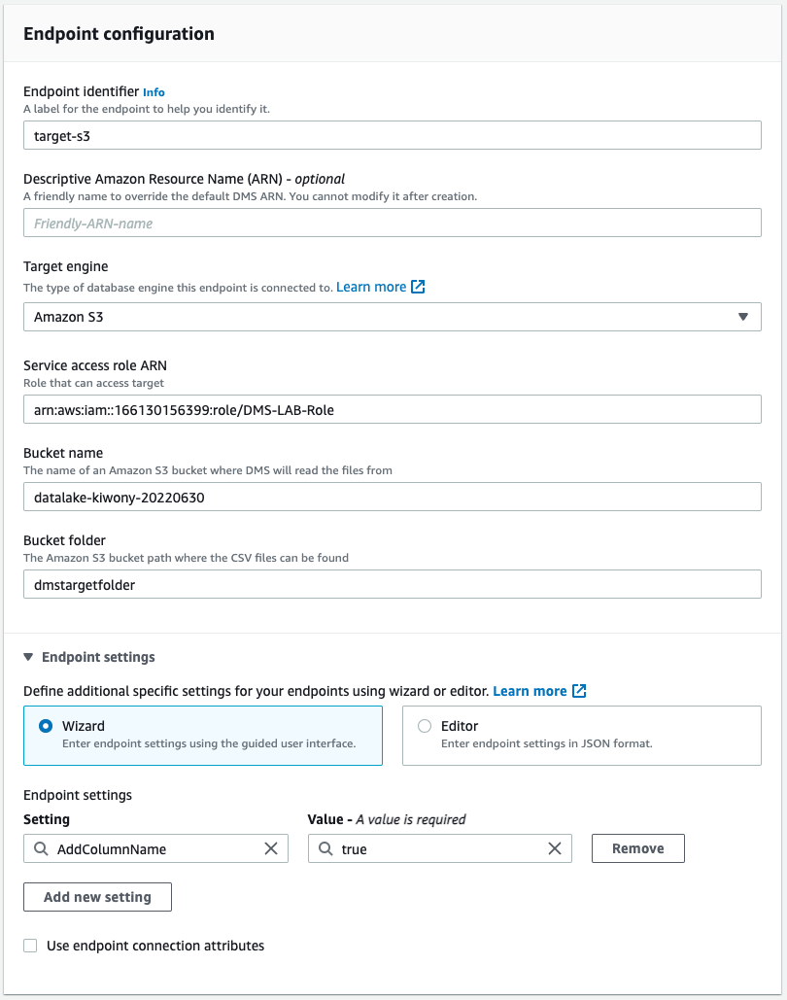
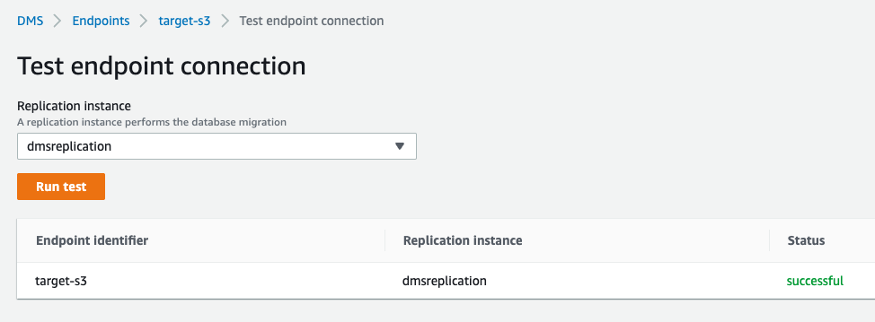
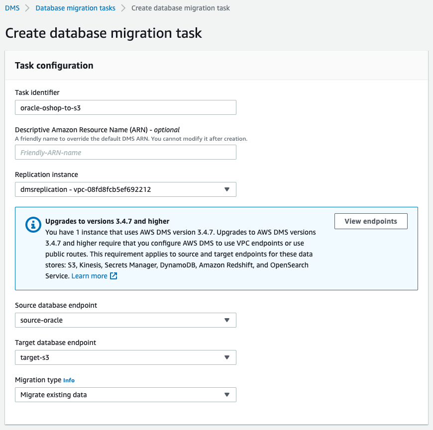
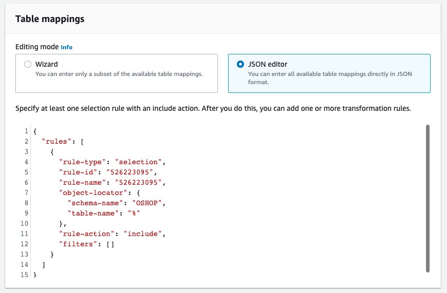
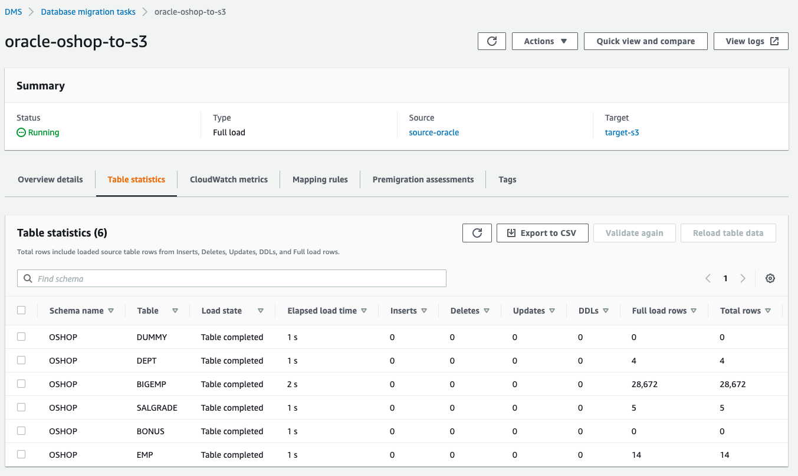

## Database Migration Service 구성

---

**DMS Replication Instance** 는 Source Database의 Data를 읽어서 Target Database(S3포함)로 이관합니다.

[](https://github.com/kiwonyoon0701/datalake-workshop/blob/master/images/image-20220417105436517.png)

---

1. Database Migration Service (DMS) [console ](https://console.aws.amazon.com/dms/v2/home#)을 새 창(새탭)으로 엽니다.

---

2. **Create Replication Instance** Click


---

3. 다음의 정보대로 입력 후 **Create** Click, 인스턴스 생성까지 5분정도 소요

```
Name : DMSReplication
Description : DMSReplication
Instance Class : dms.c5.large
Engine version : 기본 값 사용
Allocated storage (GB) : 50
VPC : vpc-xxxxxxxxxxxx - OnPREM
Multi-AZ	: Dev or Test
Publicly accessible	: No(체크안함)
나머지 기본 값 사용
```


---

#### Source Endpoint 생성

---

1. **Replication Instance** 생성 확인 후, 메뉴 좌측 "Endpoints" Click

------

2. **Create Endpoints** Click

[](https://github.com/kiwonyoon0701/datalake-workshop/blob/master/images/image-20220417110138267.png)

------

3. 다음의 정보대로 Source Endpoint를 구성하고

**Run Test** 를 Click하여 **RI(Replication Instance)** 와 접속 여부를 확인

접속이 successful이 되면 **Create endpoint** Click

```
Endpoint Type	: Source endpoint
Endpoint Identifier	: source-oracle
Source Engine :	Oracle
Access to endpoint database : Provide access information manually
Server Name	: < IPOraclePrivateIP > (CloudFormation Output에서 확인했던 값 사용)
Port	: 1521
SSL Mode :	none
User Name	: dms_user
Password	: dms_user
SID/Service name : salesdb

Test endpoint connection(optional)
Test endpoint connection -> VPC	< VPC ID from Environment Setup Step >
Replication Instance	: dmsreplication 
```






------

#### 

#### Target Endpoint(S3) 생성

---

1. **Replication Instance** 생성 확인 후, 메뉴 좌측 "Endpoints" Click

------

2. **Create Endpoints** Click

------

3. 다음의 정보대로 Target Endpoint를 구성하고

   **Run Test** 를 Click하여 **RI(Replication Instance)** 와 접속 여부를 확인

   접속이 successful이 되면 **Create endpoint** Click

```
Endpoint Type	: Target endpoint
Endpoint Identifier :	target-s3
Source Engine	: Amazon S3
Service access role ARN : < ARN of the DMS-LAB-Role > (앞의 IAM에서 복사한 IAM Role ARN사용)
Bucket name	: < Name of Your S3 Bucket > (앞서 생성한 Bucket 이름 사용)
Bucket folder	: dmstargetfolder (Bucket아래에 생성했던 Folder 이름 사용)

# Endpoint settings
Wizard 선택
"Add new setting" Click
AddColumnName을 선택 하고 true 입력 (RDB Table의 Column이름을 가져오기 위한 설정)
```








---

#### DMS Task 생성

---

1. **Replication Instance** 생성 확인 후, 메뉴 좌측 "Database Migration tasks" Click

------

2. **Create Task** Click

------

3. 다음의 정보대로 **Task Configuration**를 구성하고 **Create Task** Click

```
Task identifier	: oracle-oshop-to-s3
Replication instance :	DMSReplication
Source database endpoint :	source-oracle
Target database endpoint	: target-S3
Migration type :	Migrate existing data

# Task settings
CDC stop mode	: Don’t use custom CDC stop mode
Target table preparation mode	: Do nothing
Include LOB columns in replication	: Limited LOB mode
Max LOB size (KB)	: 32
Enable validation	: Unchecked
Enable CloudWatch logs	: Checked

# Table mappings
Editing mode : JSON editor 선택 후 아래 JSON으로 변경

{
  "rules": [
    {
      "rule-type": "selection",
      "rule-id": "526223095",
      "rule-name": "526223095",
      "object-locator": {
        "schema-name": "OSHOP",
        "table-name": "%"
      },
      "rule-action": "include",
      "filters": []
    }
  ]
}
```






---

4. Task **oracle-oshop-to-s3** 가 실행 (Starting)으로 바뀌면 Click하여 작업 상황을 모니터링


---

5. **Table statistics** 를 Click하여 Migration 상황을 확인합니다.



---

### S3 Bucket을 확인하여 Data가 제대로 이관되었는지 확인

---

1. Open the [Amazon S3 console ](https://console.aws.amazon.com/s3/)을 새 창(새탭)으로 엽니다.

---

2. 아까 생성한 Bucket으로 이동하고, **dmstargetfolder** 를 Click 합니다.

   OSHOP folder 아래에 다음과 같이 Data들이 이관됨을 확인


---

3. **EMP** Folder로 이동하여 생성된 파일을 Check 한 후 **Actions** => **Query with S3 Select** 를 선택


---

4. **SQL query** 아래 **Run SQL Query**를 Click 하여 Select 실행


---

