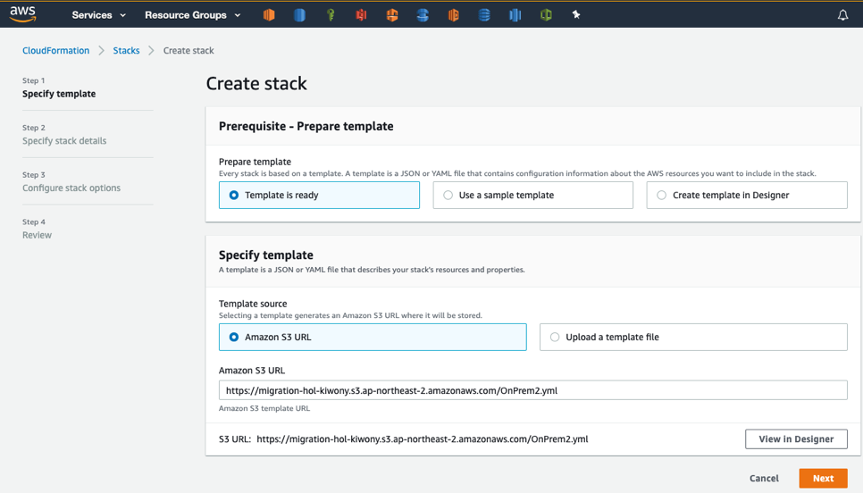
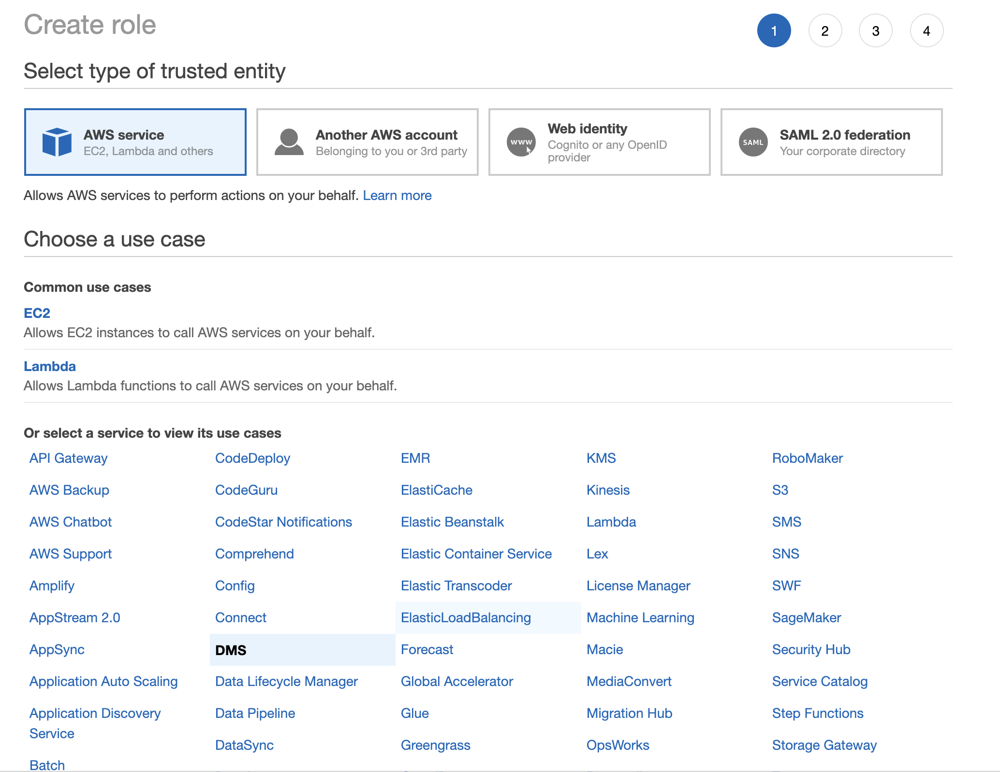
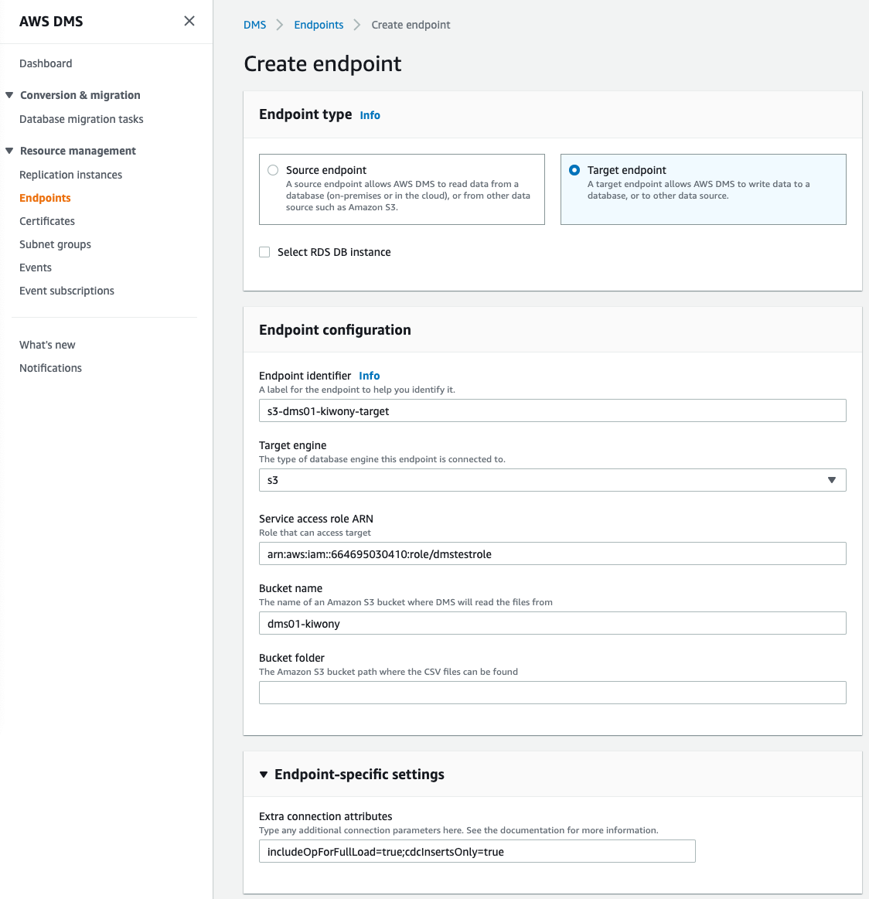
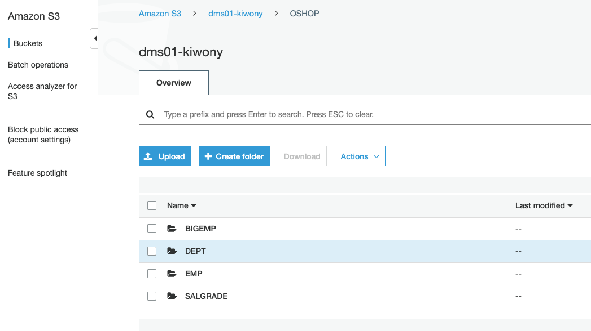
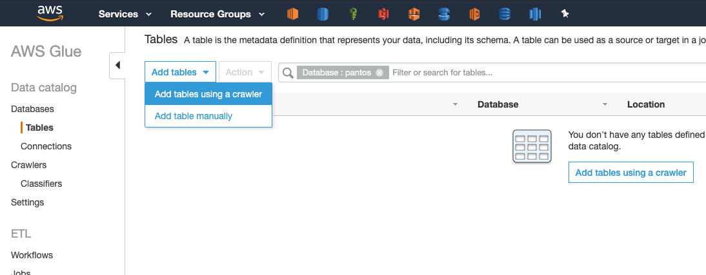
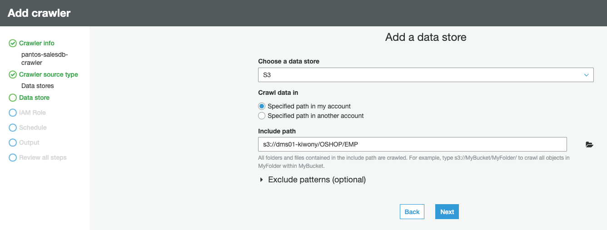
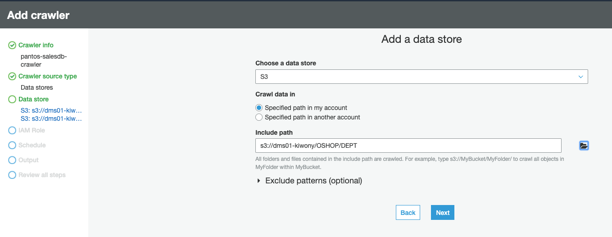
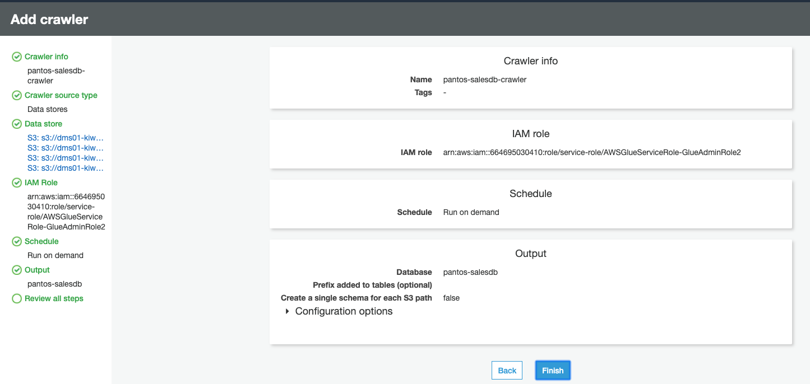
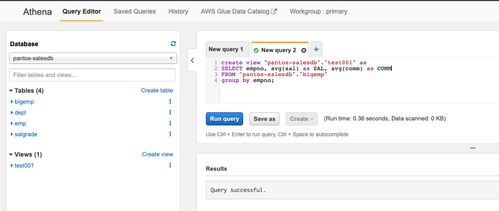

This document describes how to build datalake on S3 from multiple data sources and ETL with glue

# Create Key Pair
1. Services -> EC2 선택
2. 화면 좌측의 "Key Pairs" Click
3. "Create key pair" Click
4. Name : id_rsa_main 입력 후 "Create key pair" click

<kbd>  </kbd>

5. 자동으로 pem key가 다운로드 됩니다. 해당 파일은 EC2 접속을 할 수 있는 중요한 key 파일입니다. 파일 퍼미션을 400으로 변경 후, 안전한 곳에 파일을 저장합니다.

<kbd>  </kbd>


# Create VPC & Test Environment

이 과정에서는 OnPREM 환경에 해당하는 OnPREM VPC와 AWS 환경에 해당하는 AWSDC VPC를 CloudFormation을 이용하여 생성합니다. 

참고 -------------------------------------------------

 OnPrem VPC :
 ONPREM-VPC 10.100.0.0/16
 ONPREM-PUBLIC-SUBNET1 10.100.1.0/24
    ONPREM-PUBLIC-SUBNET2 10.100.2.0/24
    ONPREM-PRIVATE-SUBNET1 10.100.101.0/24
    ONPREM-PRIVATE-SUBNET2 10.100.102.0/24

  
1. Services -> CloudFormation 선택
2. OnPREM VPC 생성 을 위해 "Create Stack" Click
3. "Amazon S3 URL" 부분에 
https://migration-hol-kiwony.s3.ap-northeast-2.amazonaws.com/OnPREM3.yml 를 입력하고 "Next" Click

<kbd>  </kbd>

4. Stack name: "OnPREM"을 입력<br>
    KeyName : id_rsa_main을 선택<br>
    나머지는 Default로 두고 "Next" Click

<kbd>  </kbd>

5. "Configure stack options"은 Default로 두고 "Next" Click
6. "Review" Page에서 "I acknowledge that AWS CloudFormation might create IAM resources with custom names."을 Check하고, "Create Stack"을 Click하여 CloudFormation 실행 

<kbd>  </kbd>

7. OnPREM Stack과 AWSDC Stack이 생성 완료 되는 것을 확인 (5~10분)

8. Stack이 완료되면 OnPREM Stack Outputs Tab의 내용 중 OraclePrivateIP, TomcatPublicIP, WindowsPublicIP를 복사해둡니다. (IP로 필터링하면 EC2 IP만 아래처럼 확인 가능합니다.)

<kbd>  </kbd>


# Create S3 bucket
1. Services -> s3 선택

2. "Create Bucket" Click

3.
```
Bucket Name : oracle-to-datalake-[USERNAME]
Region : Asia Pacific(Seoul)
```

**Example** : `oracle-to-datalake-kiwony`

<kbd>  </kbd>

4. Click "Create"


# Create IAM Policy & Role

1. Services -> IAM

2. "Policies" Click

3. "Create Policy" Click

4. "JSON" Click

**Policy** : `prod.dms.s3.access.policy`

***Please replace s3 bucket name as yours***

```
{
    "Version": "2012-10-17",
    "Statement": [
        {
            "Effect": "Allow",
            "Action": [
                "s3:PutObject",
                "s3:DeleteObject"
            ],
            "Resource": [
                "arn:aws:s3:::oracle-to-datalake-kiwony*"
            ]
        },
        {
            "Effect": "Allow",
            "Action": [
                "s3:ListBucket"
            ],
            "Resource": [
                "arn:aws:s3:::oracle-to-datalake-kiwony*"
            ]
        }
    ]
}
```

<kbd>  </kbd>

5. "Review policy" Click

6.  Name : prod.dms.s3.access.policy

7. "Create policy" Click

### Create Role

**Role** : `prod.dms.s3.access.role`
**Attach Policy** : `prod.dms.s3.access.policy`

1. Services -> IAM

2. "Roles" Click

3. "Create role" Click

4. 
```
Select type of trusted entity : AWS service
Choose a use case : DMS
```

<kbd>  </kbd>


5. "Next: Permissions" Click

6. Attach the created policy - `prod.dms.s3.access.policy`

<kbd>  </kbd>

7.
`Role Name : prod.dms.s3.access.role`

<kbd>  </kbd>

8. "Create role" click

# DMS Pre-requirement for Oracle

이 과정에서는 SQL Developer를 이용하여 Source OnPREM Oracle에서 Migration을 위한 선행 작업을 수행합니다. 
이 선행 작업은 DMS를 이용하여 S3 Datalake로 Data를 이관하는데 필요합니다. 

1. OnPREM stack Outputs의 WindowsPublicIP를 확인합니다.

2. RDP Client(mstsc.exe)를 실행하고 Windows Server에 접속

3. User name : administrator 

4. Password : cm4&gFxSBN@E5AWW)gL@@wTJ=N(IoToo   <= 공백이 없도록 주의하세요!!

5. “Shutdown Event Tracker” 경고창이 뜰 경우 “Cancel”을 누릅니다.

6.	Windows Server 화면 아래, MySQL Workbench 메뉴 옆의 SQL Developer 실행 

<kbd>  </kbd>

7.	화면 좌측의 + Button을 Click하고 아래처럼 입력

<kbd>  </kbd>

```
a.	Name : OnPREM-ORACLE
b.	Username : sys
c.	Role : SYSDBA
d.	Password : Octank#1234
e.	Hostname : ORACLE-ON-EC2의 Private IP
f.	Port : 1521
g.	SID : salesdb
h.	“Save” Click
i.	“Test” Click 후 Status : Success 확인
```

<kbd>  </kbd>


### Execute following commands on session manager console

```
oracle@oracle11g:/home/oracle> sqlplus / as sysdba

create user dms_user identified by <PASSWORD> default tablespace users temporary tablespace temp quota unlimited on users;
grant connect, resource to dms_user;
grant EXECUTE ON dbms_logmnr to dms_user;

GRANT SELECT ANY TRANSACTION to dms_user;
GRANT SELECT on V_$ARCHIVED_LOG to dms_user;
GRANT SELECT on V_$LOG to dms_user;
GRANT SELECT on V_$LOGFILE to dms_user;
GRANT SELECT on V_$DATABASE to dms_user;
GRANT SELECT on V_$THREAD to dms_user;
GRANT SELECT on V_$PARAMETER to dms_user;
GRANT SELECT on V_$NLS_PARAMETERS to dms_user;
GRANT SELECT on V_$TIMEZONE_NAMES to dms_user;
GRANT SELECT on V_$TRANSACTION to dms_user;
GRANT SELECT on ALL_INDEXES to dms_user;
GRANT SELECT on ALL_OBJECTS to dms_user;
GRANT SELECT on DBA_OBJECTS to dms_user;
GRANT SELECT on ALL_TABLES to dms_user;
GRANT SELECT on ALL_USERS to dms_user;
GRANT SELECT on ALL_CATALOG to dms_user;
GRANT SELECT on ALL_CONSTRAINTS to dms_user;
GRANT SELECT on ALL_CONS_COLUMNS to dms_user;
GRANT SELECT on ALL_TAB_COLS to dms_user;
GRANT SELECT on ALL_IND_COLUMNS to dms_user;
GRANT SELECT on ALL_LOG_GROUPS to dms_user;
GRANT SELECT on SYS.DBA_REGISTRY to dms_user;
GRANT SELECT on SYS.OBJ$ to dms_user;
GRANT SELECT on DBA_TABLESPACES to dms_user;
GRANT SELECT on ALL_TAB_PARTITIONS to dms_user;
GRANT SELECT on ALL_ENCRYPTED_COLUMNS to dms_user;
GRANT SELECT on V_$LOGMNR_LOGS to dms_user;
GRANT SELECT on V_$LOGMNR_CONTENTS to dms_user;
GRANT SELECT on ALL_VIEWS to dms_user;
GRANT SELECT ANY TABLE to dms_user;
GRANT ALTER ANY TABLE to dms_user;
GRANT create any directory to dms_user;
ALTER DATABASE ADD SUPPLEMENTAL LOG DATA;
ALTER TABLE OSHOP.DUMMY ADD SUPPLEMENTAL LOG DATA (PRIMARY KEY) COLUMNS;
ALTER TABLE OSHOP.EMP ADD SUPPLEMENTAL LOG DATA (PRIMARY KEY) COLUMNS;
ALTER TABLE OSHOP.DEPT ADD SUPPLEMENTAL LOG DATA (PRIMARY KEY) COLUMNS;
ALTER TABLE OSHOP.BIGEMP ADD SUPPLEMENTAL LOG DATA (ALL) COLUMNS;
ALTER TABLE OSHOP.BONUS ADD SUPPLEMENTAL LOG DATA (ALL) COLUMNS;
ALTER TABLE OSHOP.SALGRADE ADD SUPPLEMENTAL LOG DATA (ALL) COLUMNS;

```

# Database Migration Service

## Create Replication Instance

<kbd>  </kbd>

## Create Source Endpoint(Oracle)

<kbd>  </kbd>

<kbd>  </kbd>

<kbd>  </kbd>

<kbd>  </kbd>

### Extra Connections attributes : includeOpForFullLoad=true;cdcInsertsOnly=true

**This endpoint will capture insert operation only**

<kbd>  </kbd>

## Create Target Endpoint(S3)

<kbd>  </kbd>

<kbd>  </kbd>

## Create Migration Task

<kbd>  </kbd>

<kbd>  </kbd>

## Check Table Statistics

<kbd>  </kbd>

## Check S3 Bucket

**4 Folders created**

<kbd>  </kbd>

## Check Initial Loading Data in S3 bucket

**4 Folders created**

<kbd>  </kbd>

<kbd>  </kbd>

<kbd>  </kbd>

## Connect to System Manager Console to raise new insert operation

<kbd>  </kbd>

```
sh-4.2$ sudo su -
Last login: Mon Apr 27 08:22:56 EDT 2020 on pts/0
root@oracle11g:/root# su - oracle
Last login: Mon Apr 27 08:22:57 EDT 2020 on pts/0
oracle@oracle11g:/home/oracle> sqlplus oshop/<PASSWORD>

SQL*Plus: Release 11.2.0.4.0 Production on Mon Apr 27 20:17:14 2020

Copyright (c) 1982, 2013, Oracle.  All rights reserved.


Connected to:
Oracle Database 11g Enterprise Edition Release 11.2.0.4.0 - 64bit Production
With the Partitioning, OLAP, Data Mining and Real Application Testing options

SQL> update emp set sal=3333 where empno=7777;
1 row updated.

SQL> update emp set comm=2222 where empno=7774;
1 row updated.

SQL> commit;
Commit complete.

SQL> insert into emp values (8888, 'yoon', 'PSA', 7902, sysdate, 4000, 1000, 10);
SQL> commit;
SQL> insert into emp values (8890, 'jenny', 'PSA', 7902, sysdate, 6000, 3000, 10);
SQL> commit;
SQL> insert into emp(EMPNO, ENAME, JOB, MGR, HIREDATE, SAL, DEPTNO) values (9999, 'TOM', 'PSA', 7902, sysdate, 5000, 10);
SQL> commit;
```

<kbd>  </kbd>

<kbd>  </kbd>

# Glue & Athena

### Create Database

<kbd>  </kbd>

### Add tables using a crawler

<kbd>  </kbd>

<kbd>  </kbd>

<kbd>  </kbd>

<kbd>  </kbd>

<kbd>  </kbd>

<kbd>  </kbd>

<kbd>  </kbd>

<kbd>  </kbd>

<kbd>  </kbd>

<kbd>  </kbd>

<kbd>  </kbd>

<kbd>  </kbd>

<kbd>  </kbd>

<kbd>  </kbd>

<kbd>  </kbd>

### View Table metadata from Glue Database

<kbd>  </kbd>

### Query Data from Athena

<kbd>  </kbd>

<kbd>  </kbd>

### Create Athena View

<kbd>  </kbd>

<kbd>  </kbd>

dms-vpc-role
AmazonDMSVPCManagementRole

dms-cloudwatch-logs-role
AmazonDMSCloudWatchLogsRole
